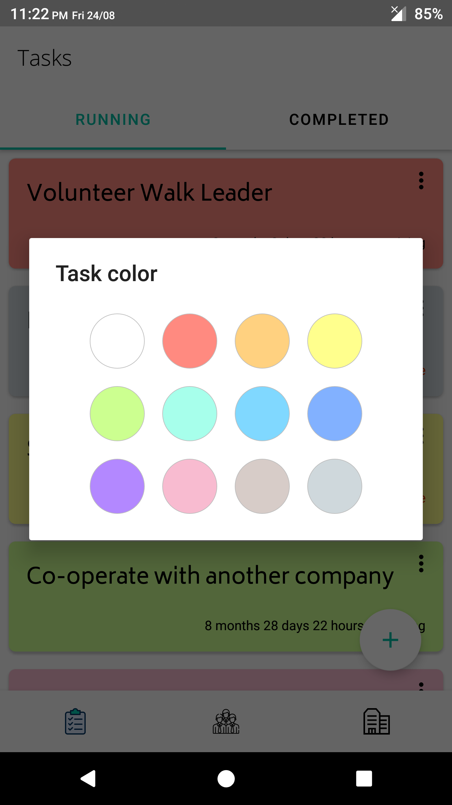
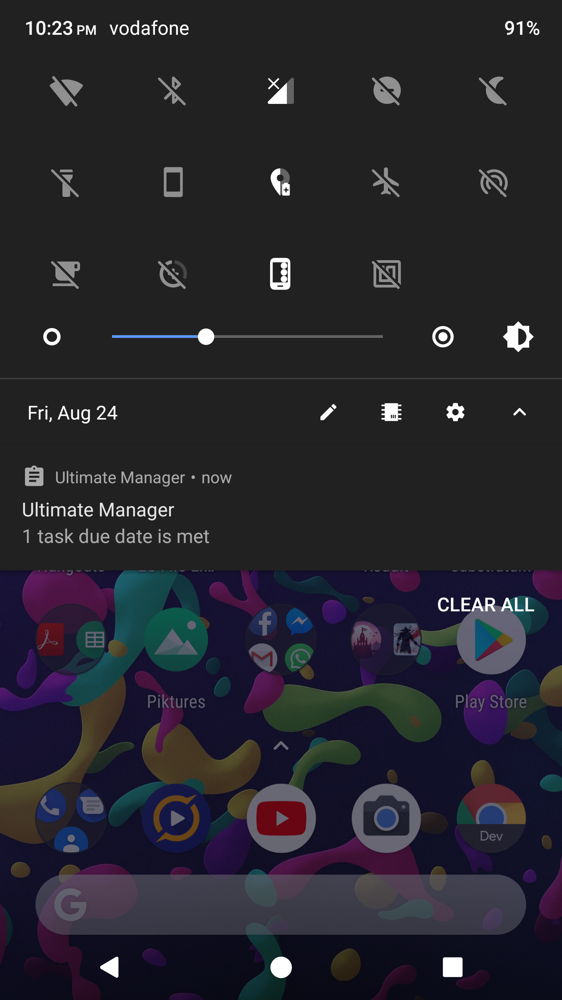

## Ultimate Manager

An Android Application that is used by managers to easily evaluate the performance of employees through recording progress and faults and producing periodic reports.

## Screenshots

## Features

- Hire and Fire employees
- Create new departments and assign/remove employees from them
- Create a task with a due date
- Assign a task to many employees
- View all tasks in the whole corp and in specific departments
- Tick off a done task and evaluate it with stars from 1 to 5
- View all tasks assigned to and done by a certain employee and average of quality (stars) of tasks delivered by him
- Write a note concerning a certain employee (a mistake he did or a compliment)
- Live counter displaying years/months/days/hours/seconds remaining till a task's due date 
- Color a task
- Recieve notifications when a task due date is met
- Images for employees and departments

## Resources
* [developer.android.com][8]
* [udacity][9]
* [stack overflow][10]
* [material.io][11]

## Libraries Used

* [Architecture Components][1] 
  * [Room][2]
  * [LiveData][3]
  * [ViewModel][4]
  * [Paging][5]
* Third party
  * [Glide][6]
  * [hdodenhof/CircleImageView][7]

[1]: https://developer.android.com/jetpack/arch
[2]: https://developer.android.com/topic/libraries/architecture/room
[3]: https://developer.android.com/topic/libraries/architecture/livedata
[4]: https://developer.android.com/topic/libraries/architecture/viewmodel
[5]: https://developer.android.com/topic/libraries/architecture/paging
[6]: https://bumptech.github.io/glide
[7]: https://github.com/hdodenhof/CircleImageView
[8]: https://developer.android.com
[9]: https://eg.udacity.com
[10]: https://stackoverflow.com
[11]: https://material.io
